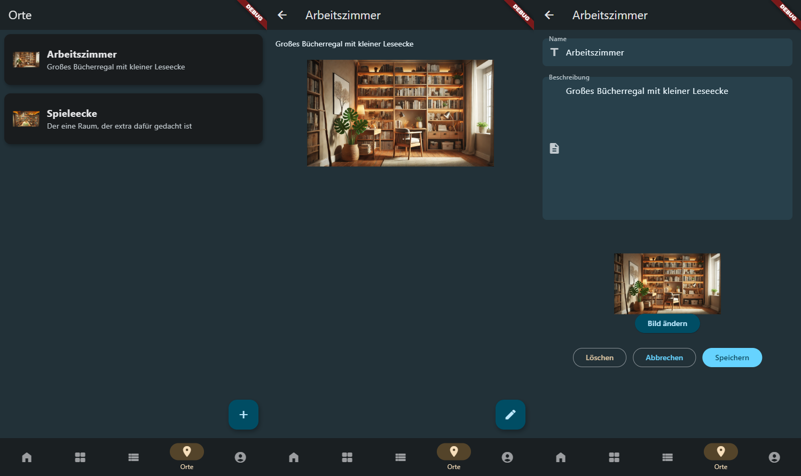

# Flutter Collector App

Collector App is an application designed to help users manage their collections of items.
The frontend is developed using Flutter, providing a seamless experience on both web and Android platforms.
The application includes authentication using Auth0 and API documentation with OpenAPI.
With features like item and collection management, location tracking, and detailed analytics, Collector App provides a tool for collectors to organize and track their collections efficiently.

The backend is built using a serverless architecture on AWS, leveraging services like AWS Lambda, API Gateway, DynamoDB, and S3.
For detailed information on the backend architecture and API documentation, please visit the [Capstone Project Repository](https://github.com/juheba/capstone-project).

Note: This app uses Auth0 with Auth0 Flutter SDK. The setup is based on the official [Auth0 Flutter Quickstart](https://auth0.com/docs/quickstart/native/flutter/interactive).

## Requirements
- Flutter 3+
- Android Studio 4+ (for Android)

## Setup & Configure Auth0 Guide

See [Auth0 Sample App README.md](./doc/Auth0_Sample_Readme.md)

# Getting started
* `dart run build_runner build`
* `dart pub global activate intl_utils` activates l10n utilities

## HELP?!
* Generate Hive Adapter Classes and Smartstruct Mapper with: `dart run build_runner build`
* To generate l10n files: `flutter pub global run intl_utils:generate`
* To generate collector-api, visit the collector-contract Repository.

# Sceenshots

**Login and user view**

**Item list, item details and editor view**

* Items can be assigned to multiple collections
* Items can be assigned to one specific location

**Collection list, collection details and editor view**

**Location list, location details and editor view**

