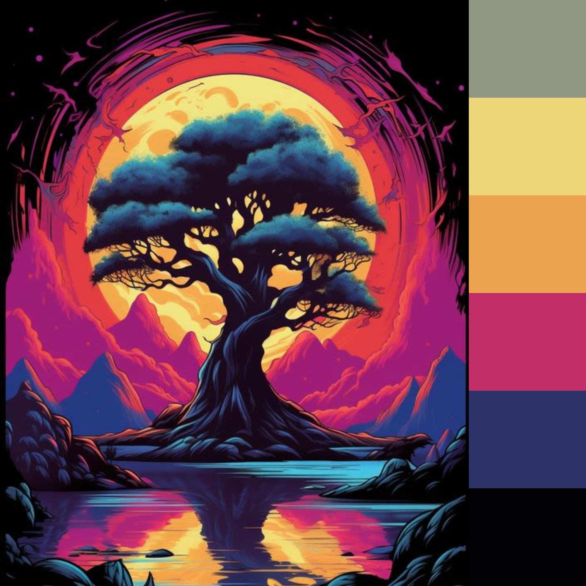
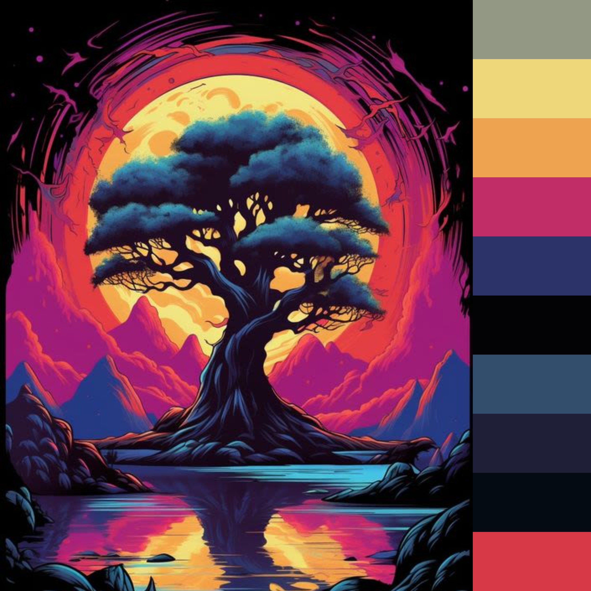

# [Image f159aea28937a232bc5b58d9111e696c.jpg]([https://](https://i.pinimg.com/564x/f1/59/ae/f159aea28937a232bc5b58d9111e696c.jpg))

### six colors:

* #939884 - A muted, medium gray with a slight greenish tint.
* #EED67A - A soft, warm yellow color, reminiscent of straw or light goldenrod.
* #EEA351 - A warm, medium orange color with a golden undertone, similar to a butterscotch or caramel color.
* #C12D66 - A vibrant, medium pinkish-red or cranberry color.
* #2C3368 - A deep, muted blue with a hint of purple, akin to a navy or indigo.
* #030205 - A very dark, almost black color with a slight bluish or grayish tint, similar to charcoal or ebony.

### ten colors:

* #939884 - A muted, medium gray with a slight greenish tint.
* #EED67A - A soft, warm yellow color.
* #EEA351 - A warm, medium orange color with a golden undertone.
* #C12D66 - A vibrant, medium pinkish-red or cranberry color.
* #2C3368 - A deep, muted blue with a hint of purple.
* #030205 - A very dark, almost black color with a slight bluish or grayish tint.
* #324E6C - A muted dark blue with a hint of gray, akin to slate blue.
* #1F1F38 - A very dark blue, almost indigo, with a hint of purple.
* #050B13 - An almost black color with a slight greenish tint.
* #D73946 - A bright, medium red with a slight pinkish hue, similar to crimson or carmine.